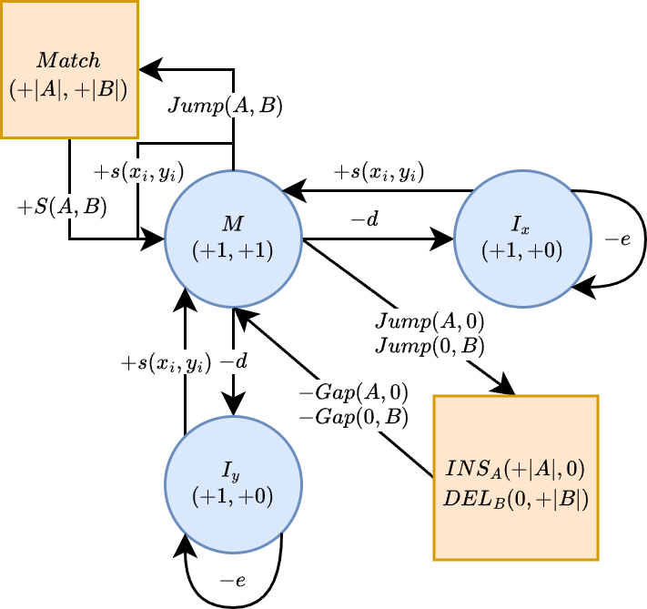
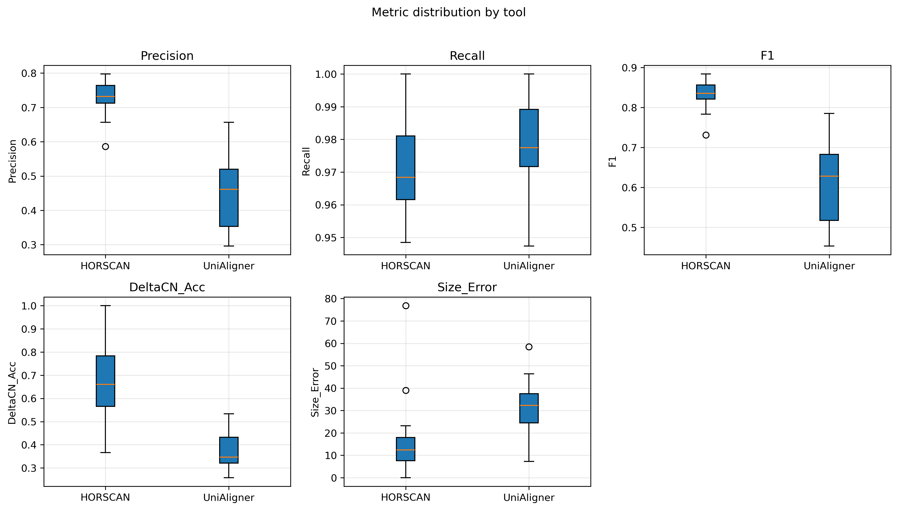
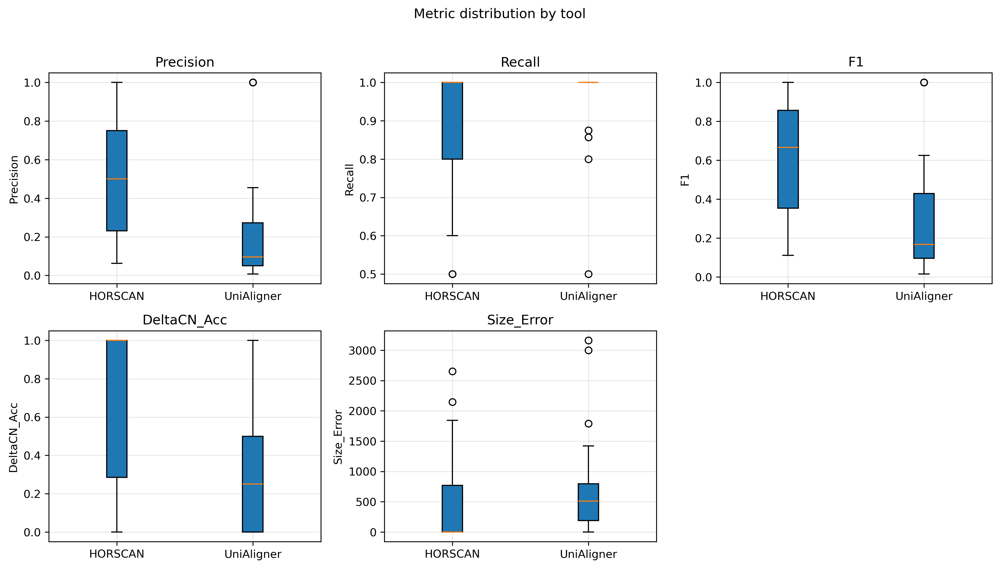

# HORSCANv: Structure-Aware Global Alignment for High-Order Repeat(HOR)

**HORSCAN** is a structure-aware global alignment tool designed to analyze
higher-order repeat (HOR) patterns in human centromeric regions.

Instead of aligning raw bases, HORSCANv operates on **monomer labels** and
**HOR annotations**. It extends classical affine-gap alignment (Gotoh) into a
**state-aware hierarchical dynamic programming** framework with a dedicated**HOR-Jump mechanism**, allowing it to:

- Enforce **HOR-level structural consistency**,
- Avoid non-biological **over-fragmented paths** in highly repetitive arrays,
- Output interpretable **HOR-level structural variant (SV) events**.

This makes HORSCANv both a **global aligner** and a **structural event parser**
for satellite DNA.

---

## 1. Installation

### 1.1 Prerequisites

- A recent [Rust toolchain](https://rustup.rs/) (including `rustc` and `cargo`).

### 1.2 Build from source

```bash
git clone https://github.com/<your-org>/HORSCANv.git
cd HORSCANv
cargo build --release
```

The optimized executable will be generated at:

```bash
./target/release/HORSCAN
```

(Optional) Install to a directory in your `PATH`:

```bash
sudo mv ./target/release/HORSCAN /usr/local/bin/
```

---

## 2. Input Data Model

HORSCANv consumes **monomer-level** and **HOR-level** annotations for both
source and target sequences.

### 2.1 Monomer files

Tab-separated, 4-column BED-like format:

1. `sample` – sample / chromosome identifier (e.g. `CHM13#chrX`)
2. `start` – 0-based inclusive coordinate
3. `end`   – 0-based exclusive coordinate
4. `label` – monomer label (e.g. `L1`, `D17Z1`)

Example:

```tsv
CHM13#chrX	1000	1170	A
CHM13#chrX	1171	1341	B
CHM13#chrX	1342	1512	D
```

### 2.2 HOR annotation files

Same 4-column format, but the label is a **HOR identifier**:

1. `sample` – same as monomer file
2. `start` – start of the HOR block
3. `end`   – end of the HOR block
4. `label` – HOR ID (e.g. `S1C1H1`, `HOR_1`)

Each HOR block corresponds to a contiguous interval of monomer indices.

---

## 3. Command-Line Usage

### 3.1 Required arguments

```bash
HORSCAN \
  --source <SOURCE_MONOMER_BED> \
  --target <TARGET_MONOMER_BED> \
  --source-hor <SOURCE_HOR_BED> \
  --target-hor <TARGET_HOR_BED> \
  --output <OUTPUT_PREFIX> \
  --mon <M_match M_mismatch M_open M_extend> \
  --hor <H_match H_mismatch H_open H_extend>
```

#### Scoring parameters

- `--mon` / `-m` (micro-level, monomer scores):

  - Four **positive** integers:
    - `<MATCH> <MISMATCH> <OPEN> <EXTEND>`
  - Internally interpreted as:
    - match: `+MATCH`
    - mismatch: `-MISMATCH`
    - gap open: `-OPEN`
    - gap extend: `-EXTEND`
- `--hor` / `-h` (macro-level, HOR scores):

  - Four **positive** integers:
    - `<MATCH> <MISMATCH> <OPEN> <EXTEND>`
  - Used as:
    - HOR label match bonus: `+MATCH`
    - HOR label mismatch penalty: `-MISMATCH`
    - HOR indel penalty: `-(OPEN + L * EXTEND)`,
      where `L` is the number of monomers in the HOR block.

Practical examples:

```bash
-m 10 4 2 2   # monomer: match=10, mismatch=4, open=2, extend=2
-h 20 10 1 1  # HOR:     match=20, mismatch=10, open=1, extend=1
```

### 3.2 Optional arguments / heuristics

- `--hor-pair-band <INT>`Pre-filter candidate HOR pairs by diagonal distance (band width). Use `0` to disable.
- `--relaxed`
  Enable relaxed HOR pairing (label equivalence) instead of strict label match.

---

## 4. Example

### 4.1 Minimal example files

```bash
# Source monomers: A B D
cat > source.bed <<EOF
CHM13#chrX	1000	1170	A
CHM13#chrX	1171	1341	B
CHM13#chrX	1342	1512	D
EOF

# Source HOR annotation
echo -e "CHM13#chrX	1000	3420	HOR_1" > source_hor.bed

# Target monomers: A B C D
cat > target.bed <<EOF
CHM1#chrX	1000	1170	A
CHM1#chrX	1171	1341	B
CHM1#chrX	1342	1512	C
CHM1#chrX	1513	1683	D
EOF

# Target HOR annotation
echo -e "CHM1#chrX	1000	5130	HOR_1" > target_hor.bed
```

### 4.2 Run HORSCANv

```bash
HORSCAN \
  --source source.bed \
  --target target.bed \
  --source-hor source_hor.bed \
  --target-hor target_hor.bed \
  --output test_result \
  -m 10 4 2 2 \
  -h 20 10 1 1
```

This will create:

- `test_result.alignment.tsv`
- `test_result.hor.tsv`

---

## 5. Output Formats

### 5.1 Monomer alignment file: `*.alignment.tsv`

Row-wise monomer-level alignment:

| Col  | Description                                              |
| ---- | -------------------------------------------------------- |
| 1–4 | Source monomer:`sample`, `start`, `end`, `label` |
| 5–8 | Target monomer:`sample`, `start`, `end`, `label` |
| 9    | Alignment status:`MTH`, `MIS`, `INS`, `DEL`      |
| 10   | Source monomer index (0-based)                           |
| 11   | Target monomer index (0-based)                           |

Example:

```tsv
CHM13#chrX	1000	1170	A	CHM1#chrX	1000	1170	A	MTH	0	0
CHM13#chrX	1171	1341	B	CHM1#chrX	1171	1341	B	MTH	1	1
CHM13#chrX	1171	1171	-	CHM1#chrX	1342	1512	C	INS	1	2
```

- `INS`: insertion in target (gap on source side).

### 5.2 HOR event file: `*.hor.tsv`

HOR-level structural events:

| Col    | Name           | Description                                                 |
| ------ | -------------- | ----------------------------------------------------------- |
| 1      | `event_type` | `MATCH`, `EXPANSION`, `CONTRACTION`, `COMPLEX`, ... |
| 2–6   | Source info    | HOR label, monomer index range, bp coordinate range         |
| 7–11  | Target info    | HOR label, monomer index range, bp coordinate range         |
| 12     | Score          | Alignment score for this HOR block                          |
| 13–16 | Stats          | Counts of match / mismatch / insert / delete within block   |

---

## 6. Algorithm Overview

HORSCANv performs **global alignment on monomer labels**, while being aware of their grouping into HOR blocks.

<p align="center">
  
</p>

In brief:

- At the **micro level**, it runs an affine-gap alignment on the monomer label
  sequences (similar to a standard Needleman–Wunsch + Gotoh model).
- At the **macro level**, it allows "HOR-jumps" that align or skip entire HOR
  blocks as single units, rather than breaking them into many tiny gaps.
- The final output includes both monomer-wise alignment (`*.alignment.tsv`) and
  HOR-level events (`*.hor.tsv`) that summarize expansions, contractions and
  matches of HOR units.

---

## 7. Simulation and Benchmarking (Brief)

We evaluated HORSCAN using **simulated centromeric datasets** generated by the
HOREvolver framework (HOR-level expansions/contractions plus base-level noise),
and compared it against generic tandem repeat aligners such as **UniAligner**.

The key qualitative observations are:

- HORSCANv produces **clean HOR-level events** with low fragmentation.
- It better preserves the true copy-number changes (ΔCN) of HOR patterns along
  the chromosome.

Example baseline comparison plots on simulated datasets:

<table>
  <tr>
    <td align="center">
      <br/>
      <sub>CHM13 chr1</sub>
    </td>
    <td align="center">
      <br/>
      <sub>CHM13 chrX
</sub>
    </td>
  </tr>
</table>

For full details of the simulation design, metrics and scripts, please refer to the separate HOREvolver / analysis repository and the method paper.

---

## 8. Repository Structure

- `src/`
  - `args.rs` – CLI argument parsing
  - `io.rs` – I/O and BED-like parsing
  - `align.rs` – core micro-level DP (Gotoh)
  - `horscan.rs` – hierarchical DP and HOR-Jump integration
  - `score.rs` – scoring utilities
  - `types.rs` – shared data structures
  - `main.rs` – program entry point
- `test/` – small example datasets and regression scripts

---

## 9. License and Citation

If you use HORSCANv in your work, please consider citing the
corresponding method paper (once available).
License information will be added here.
